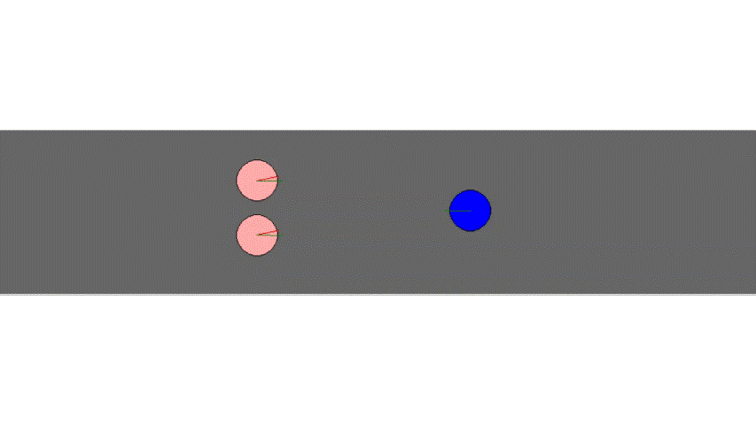

# Sampling Based local navigation

The following functions and variables were implemented and used for simulating 3_agent and 8 agent scenarios.

Functions:

1. computeNewVelocity
	To create sample velocities, identify neighbours that are within sensing radius of an agent, identify the neighbor which has the least time to collision, implement cost function to calculate which of the sample velocity will have least cost.

2. dist_check
	To calculate shortest distance between any two agents. Takes self, x and y coordinate(x_corodinate, y_coordinate) of the other agent as input. Returns the distance between two agents.

3. ttc
	To determing time to collision between two agents considering their relative position and velocities. Self, other agent(j) and self's x and y velocities(vx & vy) are given as input. Returns 'inf' if there they would collide or 0 if they have collided or time to collision if they are about to collide.
	Reference source: https://fb7024eb-a-1e6e9713-s-sites.googlegroups.com/a/g.clemson.edu/cpsc-motion/schedule/lec02.pdf?attachauth=ANoY7cqNf3JNqsNz_9DmnxtKNqGgW34dF5TWTmzEysiRpLfZII3dUhEuCpXmADz0g4pN_Kk6dGnFNChjX1klSNnWck-Gli7A8dcGFNFJiHm8oukUaBwp8lWGVA8PPrR0XsV-BHo72bLhumUlY3JQ9Icvno2LMmlwgTlyAxrzj52kmMxo6KO1BgMPs3KBKJBUkPG-ygZn1-vLVEiLlONTdLVjuAl-1xbzwA%3D%3D&attredirects=0	

Parameters:

1. least_cost - list to strore cost associated with different sampling velocities
2. alpha, beta, gamma - coefficients of cost functions, tuned for optimal results
3. nearest_agents - list to store agents that are within sensing radius of an agent
4. distances - list to store distance between self and agents in nearest agents list
5. nearest_agent - to store agent that is nearest of all the agents within sensing radius
6. nx,ny - number of sample point on x and y axis of velocity vector since a grid wise velocity sampling has been taken.
7. x,y - sample points on x & y axis of velocity vector space.
8. xv, yv - velocity vector sampling , xv- velocity vector in x direction, yv - velocity vector in y direction.
9. high_v_index - list used to filter xv,yv velocity components whose resultant velocity would exceed maximum possible velocity of the agent
10. neighbors - list of all agents in the scenario
11. xvi, yvi - velocity variable used during cost evaluation of sample velocities
12. v1 - difference between candidate velocity and goal velocity
13. v2 - difference between candidate velocity and current velocity
14. tc - time to collision for different candidate velocities
15. index - index value of least_cost list which has least cost, used to access the corresponding candidate velocity for assigning as new velocity.
16. distance - to calculate distance between centers of two agents.
17. x - position vector of nearby agent
18. r - radius of nearby agent
19. vi - velocity vector of self agent
20. vj - velocity vector of nearby agent
21. vg - goal velocity vector of nearby agent
22. rad - sum of self agent and nearby agent
23. sqrt_sample_size - square root of sample size of velocity space

## Outputs

### 3 Agents

### 8 Agents

### Multi Agents

