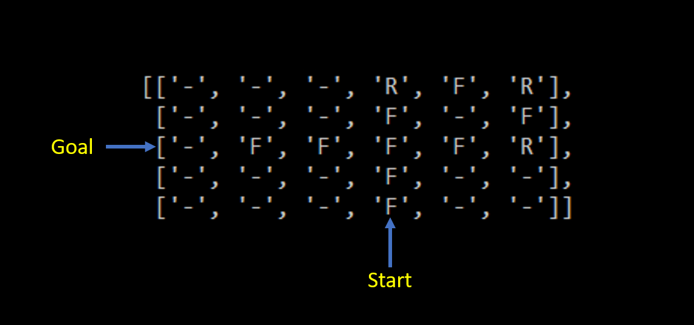

# A star algorithm

Methods created

neighbour_orientation
	To determine the orientation of child node with respect to parent node
	Takes parent node and child node as input.
	Returns orientation as output.

Finds the differene between child node and parent node coordinates is calculated and compared with forward list that was provided.

find_neighbour
To determine the feasible neighbour around a node
Takes the grid and current node as input
Returns a list of feasible nodes 

Finds all possible nodes around a node which are node below, left, right and above the current node. Once this list is arrived they are filtered to eliminate nodes that are out of bounds or a non navigable node or a node that is right behind the current node since moving forward, turning left & moving forward , turning right & moving forward are the only possible 3 actions that can be performed by the car. The list of feasible nodes are then returned as output.

find_value
To determine the cost of moving to a child node
Takes current node's cost , location of child node and the action to be taken as input.
Returns the cost of moving to a particular node as output
	
The cost of moving to a node is sum of the heuristic cost of that node, path cost for that node and action cost for the action that is taken to move to that node. The heuristic cost is found from the heuristic cost list, the path cost of child node is path cost of parent plus 1, action cost is found using cost list.

move_action
To determine the action that needs to be executed by the parent in order to reach the child.
Takes current node and child node as input
Returns the action to be taken as output

Action is difference in orientation between child node and parent node. if the action is 1 then it is left turn, if it is -1 then it is right turn. There will be exception where the car would turn from north to east when the action value will be 3 that essentially means left turn similarly for east to north orientation as well.

Variables

node_cost - a 3d list similar to parent list. This is used to store the cost for each node. The purpose of this is to use this as a condition when updating the parent of any node. A child can have two possible parent nodes therefore it is essential to identify which should be the right parent node. Cost of moving to a child from parent is the right measure with which we can determine the parent list needs to be updated or not. The node_cost elements are initialized to high value like 100 so that as when we identify a child node its value will be less than this place holder value and therefore would get substituted but when the same child node comes again the new cost will be compared against the previous cost and the parent node which would cause the least cost will be choosen.

orientation - the orientation of child with respect to parent.
neighbours - all possible child nodes of a parent node
feasible_neighbours - filtered list of neighbors
action - action that needs to be taken by car to move from parent node to child node.
neighbour - child node part of neighbours list
current_value - cost object of current node
f_prev - previouscost object of node if it is found to be present in open set
f_prev_f - the previous f value of node if it is found to be present in open_set.
total_cost_neighbour - the total cost of moving from parent node to a child node.

## Output

