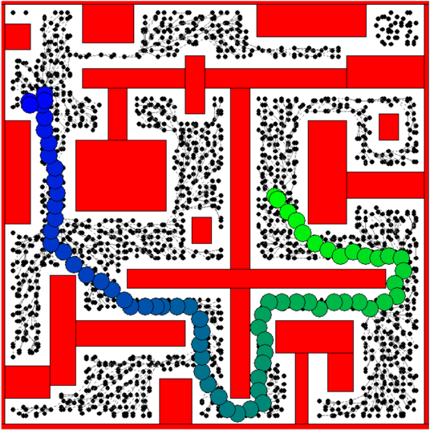
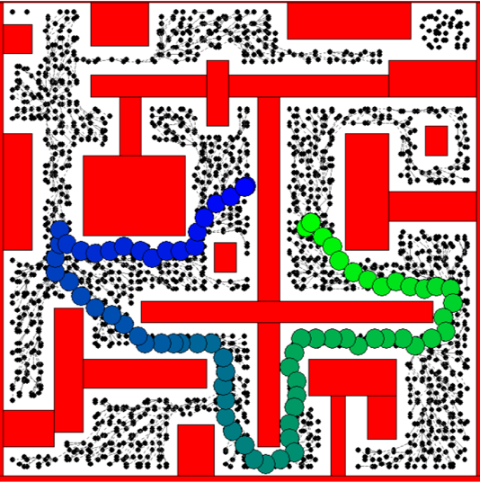
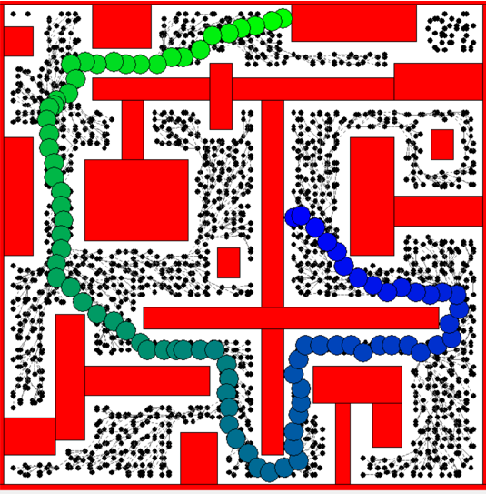

# PRM planner

## Methods

### k_nearest_neighbors

input - graph,vertex,k size
output - list of K nearest neighbors

To identify 'k' number of neighboring vertices that are around a given vertex , to form edges along with it. When checking for K nearest neighbors we filter out those vertices that have been already visited, this would eliminate instances of loop formation as well as duplicate edge being formed between two vertices. In addition to number of neighbors we also limit the neighbors to be less than d units of distance so that the vertex doesnt form an edge with another vertex that is far away, thereby this ensures that the far way edge would have form a edge with another vertex that is nearby it.

### build_roadmap

To build roadmap by creating a random set of vertices then joining them to form edges by ensuring that there are no loops or duplicate edge and at the same time connecting all vertices.
	First inorder to create a list of vertices that are random , an equally spaced 2d grid is generated using numpy arange with the canvas dimensions as limits. Once grid is made random noise is added to the x and y coordinate. This method ensures that there is no clustering of vertices and at the same time all the traversable region of configuration space is covered. The resulting x and y coordinates are shuffled again to make it more random and combined to form a set of possible vertices. 
	In order to ensure that vertices dont appear inside a obstacle, each vertex is checked for its coordinate presence within bounds of each obstacle and a flag is set to be True if they are found to be inside an obstacle. After checking through the obstacles only those points for which the above mentioned flag is False is added as vertex.
	Once vertices are created now edges need to be formed, this is done through finding out K nearest neighbors as mentioned earlier. Once the nearby vertices are found , before forming an edge we need to check whether the resulting edge cuts across any of the obstacle. In order to determine that we checked for intersection of every edge with all 4 sides of the obstacle since the 4 sides are essentially lines. Equations from the following source (http://www.cs.swan.ac.uk/~cssimon/line_intersection.html) were used to determine the possibility of an edge collision with an obstacle. Those nearby vertices which cross this stage are added as edges and these nearby vertices would be called child vertices of the first vertex and added to a list 'edge_path'. Along with creation of edge a flag called connetedComponentNr is set to True for those vertices for which edge is formed. Now this would act as a check which would ensure that now new edge would be created that would have this vertex has destination edge. Thereby looping is eliminated. Now K nearest neighbors are identified for the vertices in the 'edge_path' . The loop of finding edge continues till all the vertices inside the edge_path are covered.

### find_path

This function is used to import the start and goal points from default and random query , add these vertices and form possible edges for these two new vertices. Astar algorithm is implemented in order to determine the most optimal between start and goal. In order to implement Astar , a open_set list which is a PriorityQueue and closed_set which is an ordered set is created. An empty list the size of number of vertices is created to store the parent node of each node , purpose is to backtrack while finding path. A cost list is created with same size as parent list, this list is used to store the cost of moving to node.In this list all the values are set to initially high value which would get updated with actual cost for that node during runtime of code.
Inside Astar algorithm , the node with lowest cost is popped and assigned to current_node. Whether current node is goal node is checked and then if not current node is added to closed set and the children of the current node is found by finding the edges going out of the current node. The destination of these edges are the children of the current node. One check is done before considering the resulting destination vertices as the children because the when checking children of child node the parent node would also show which needs to be eliminated. Therefore the destination vertices which result from getedges are checked if they are present in closed_set, only those vertices that are not present in closed_set are considered as child vertices. For each and every child vertex  total cost is calculated. Total cost consists of path cost and heuristic cost. The path cost for the child is sum of path cost of parent and distance between parent and child. The heuristic cost is assumed to be distance between child and goal. 
	The child is checked whether it is present in open or closed set, if not it is added to open set. If it is present in open set then the cost of the child in open set is compared with newly calculated cost, if newly calculated cost is less than existing cost then the child in open set is updated with new cost.
	In order to update parent list we use the cost of child node as deciding condition, if the calculated cost of child node is less than that in the cost list that was created earlier then the cost list is updated with new cost and the current node is added as parent in parent list for that child.
	Once the goal has been reached now the path is found by backtracking using parent list. Once the final node has been reached, the current node is added to closed list and a while loop is created which would run till the current node becomes start node. Inside the while loop , the parent of current node is found by using the parent list which was populated earlier. The found parent's coordinates are appended to path list which was created before. The parent node is made current node and loop continues till current node reaches start node. After this path is returned.

### heuristic_cost
To determine the heuristic cost of child node , this is calculated to be eucledian distance between child node and goal node.

### path_cost 
Determines the distance between child node and parent node and adds path cost of parent node , this results in path cost of child node. 

## Parameters

xx - range of numbers for x coordinate between x limits of the canvas
yy - range of numbers for y coordinate between y limit of the canvas
x - x coordinate of the vertices
y - y coordinate of the vertices
vertex_in_obstacle - flag to represent whether a vertex would be inside an obstacle
vertices - a list of all vertices in configuration space
edge_path - list to store child vertices while for creating the edges
ep - index to iterate through edge_path list
parent_vert - parent vertex for which nearby vertices would be found and edge is formed, these nearby vertices are added to the edge path list.
k_nearest_agents - list of k agents that are nearby the parent vertex
start_vertice - object of qstart vertex
end_vertice - object of qgoal vertex
connetedComponentNr - Flag to indicate whether a vertex has been visited
vert_k - temporary variable that is used to store object of vertex

## astar parameters
parent - list to store parent node for each child node
cost_history - list to store cost of each node
neighbours - temporary list to store child nodes of a parent node in astar
child_id - id of the child
child_vertex - object of child
f_prev - previous cost of child 

## Outputs

The algorithm was checked with default queries and as well as random queries to get the path as follows.

### Default query

### Random query 1

### Random query 2

