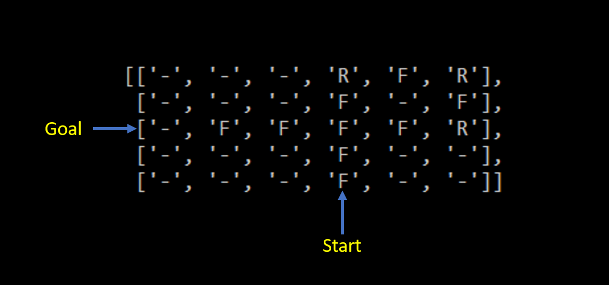

# cpsc8810_MotionPlanning
The following repository contains work that has been done as part of Motion Planning course by Dr. Ioannis Karamouzas at Clemson University during Spring 2020.

## Knowledge gained
I learnt the following concepts over the course work which greatly enabled me to understand and implement motion planning concepts in practice.
1. Local Navigation
    1. Power law - Time to Collision (TTC) model.
    2. Uncertainity in measurement and how to model them.
2. Searching Algorithms
    1. Uniform Cost Search
    2. A*, D* Lite, Anytime D*
3. Decision Theoretic Planning
    1. Configuration Spaces.
    2. Sampling-based planning (PRM, RRT, RRT*)
    3. Planning under differential constraints.
4. Sensors, Robot Localization and Mapping
    1. Probability theory 
    2. Sensors, Localization and Mapping (Discrete Bayes Filters, Particle Filtering).
5. Reinforcement Learning
    1. Q-Learning
    2. Functional approximation
    3. Policy gradient

The assignments were done as a team of 2 by
1. Manikanda Balaji Venkatesan
2. Ajinkya Joglekar

### Assignment 1 - Sampling based local navigation
Code has been tested for 3 different scenarios and the results are as follows.
The velocity of the agents are determined based on time to collision model, and these calculated velocity is applied to the agents to follow. 
It assumes no uncertainity in measurement.

### Assignment 2 - Local Navigation with TTC Forces
A Predictive TTC forces approach has been impleemented for local navigation.
Uncertainity has been incorporated for sensed velocities of the neighbors using isotropic formula.
Model has been checked for same scenarios as earlier assignment.

### Assignment 3 - Discrete planning of simple car using A*
A* algorithm has been implemented in a 2D grid. The car is assumed to have a 3 dimensional state space that consists of x & y position and its orientation.
The car is capable of three actions namely moving forward (F), turn right & move forward (R), turn left & move forward (L).
The cost of each movement has been given as well.

### Assignment 4 - Sampling based Navigation
A probabilistic roadmap metho is apploed to motion planning of a 2D robot moving in an environment with static obstacles.
A roadmap of nodes are created randomly and connected via edges.
Start and goal location are choosen and a path joining to start and goal is formed.
A* algorithm is applied to find the optimal path from star to goal from all the possible paths generated previously.

### Final Project - RRT* for turtlebot
The project named "Implementation of RRT* Algorithm for motion planning of Turtlebot in Gazebo" was done in collaboration by 
1. Manikanda Balaji Venkatesan
2. Siddhant Srivatsava
3. Mohammed Anas Khan
4. Akansha Smriti

